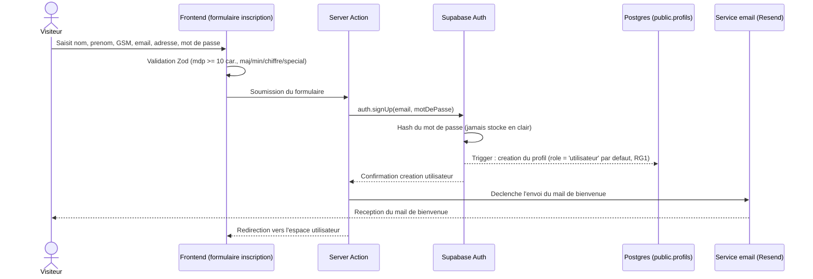
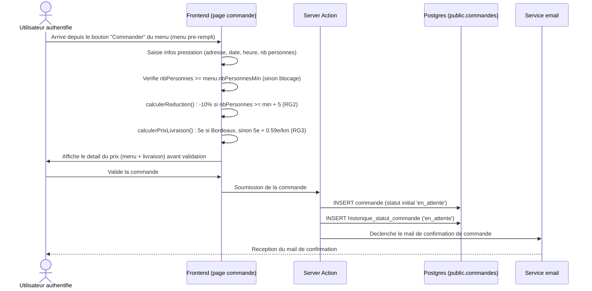
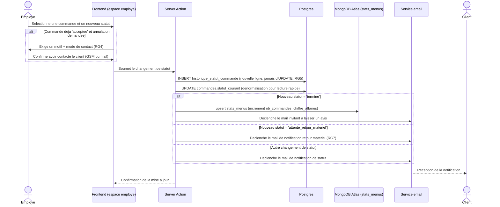
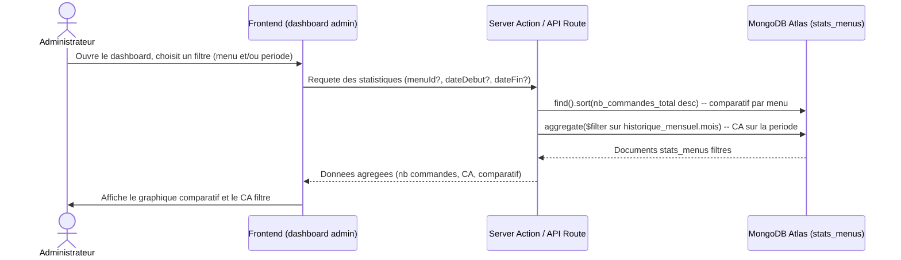

# Diagrammes de séquence — Vite Gourmand

Auteur : Arthur Gatoux (FastDev) — Projet ECF TP Développeur Web et Web Mobile (Studi)

Quatre parcours critiques, choisis parce qu'ils couvrent chacun une contrainte non négociable du CDC :
authentification sécurisée, calcul de prix avec règles métier, traçabilité de commande (jamais de mutation
destructive), et exigence de base non relationnelle pour les statistiques admin.

## 1. Inscription d'un visiteur (création de compte)

## 2. Commande d'un menu (calcul prix, réduction, livraison)

## 3. Changement de statut d'une commande par un employé

## 4. Consultation du dashboard statistique (administrateur)

## 5. Points de vigilance transverses

- Le mot de passe n'est jamais manipulé en clair côté serveur applicatif : Supabase Auth gère le hash.
- Aucune mutation destructive de l'historique de statut (RG5) : chaque changement crée une nouvelle ligne.
- La synchronisation vers MongoDB n'a lieu qu'au passage en statut `termine`, jamais à la lecture du dashboard.
- Toutes les notifications email sont déclenchées côté serveur (Server Action), jamais côté client.
