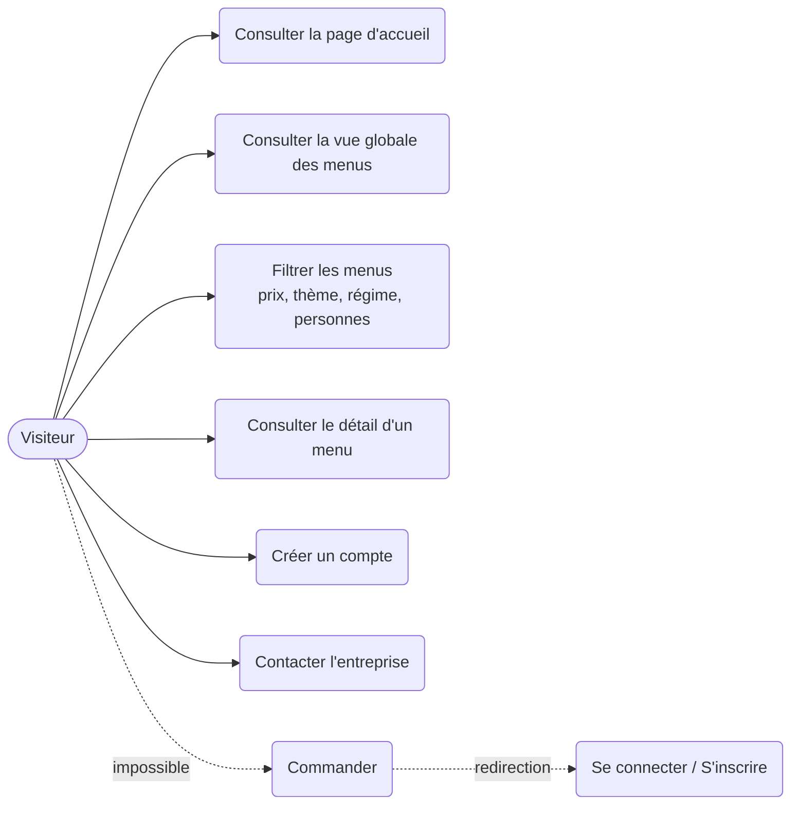
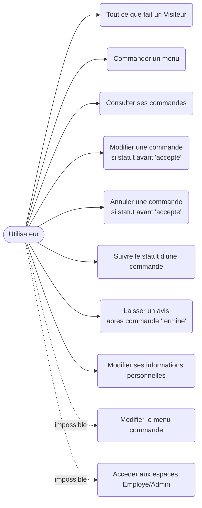
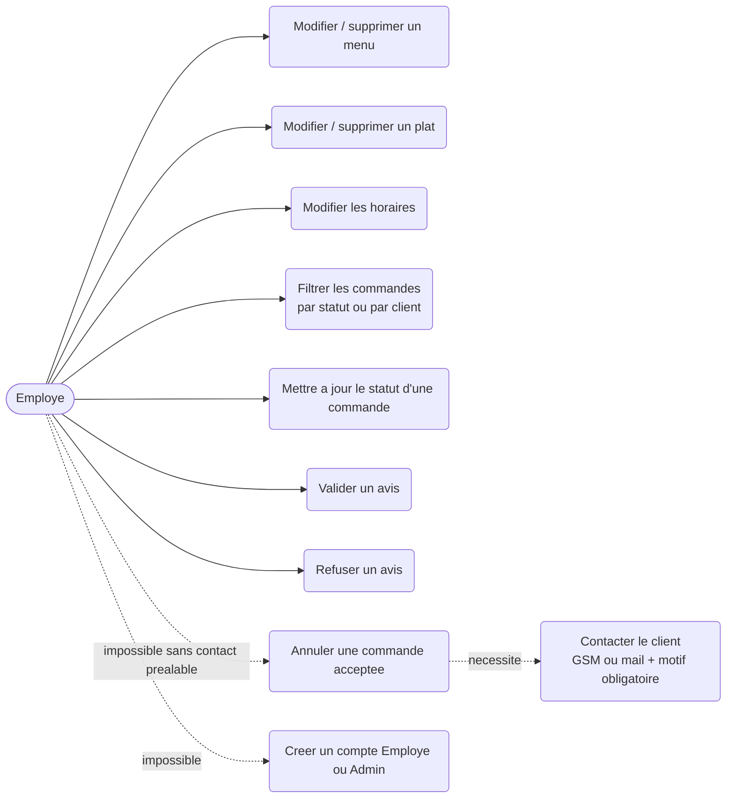
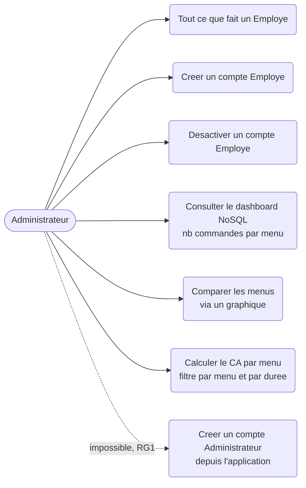

# Diagrammes de cas d'utilisation — Vite Gourmand

Auteur : Arthur Gatoux (FastDev) — Projet ECF TP Développeur Web et Web Mobile (Studi)

Ces diagrammes traduisent en UML le tableau rôle/permissions de `docs/Analyse-Besoins-ViteGourmand.md`,
lui-même issu du CDC (page 3 à 9). Mermaid n'ayant pas de type de diagramme "cas d'usage" natif, chaque
acteur est représenté par un rectangle, et chaque cas d'usage par une forme "stadium" (convention standard
pour ce rendu en flowchart Mermaid).

## 1. Visiteur (non authentifié)

## 2. Utilisateur (authentifié, rôle `utilisateur`)

## 3. Employé (rôle `employe`)

## 4. Administrateur (rôle `administrateur`)

## 5. Synthèse des règles d'accès transversales

| Règle | Description | Origine |
|---|---|---|
| RG1 | Le rôle administrateur n'est jamais atteignable via un formulaire applicatif (création manuelle uniquement) | CDC p.9 |
| RG4 | Une commande ne peut être modifiée/annulée par l'utilisateur qu'avant le statut `accepte` | CDC p.7 |
| — | Un employé ne peut annuler une commande acceptée sans avoir contacté le client au préalable (motif obligatoire) | CDC p.8 |
| RG6 | Un avis n'est visible sur l'accueil qu'après validation par un employé | CDC p.7 |

Ces diagrammes serviront de base aux diagrammes de séquence des parcours critiques (étape suivante de la Todo Global).
