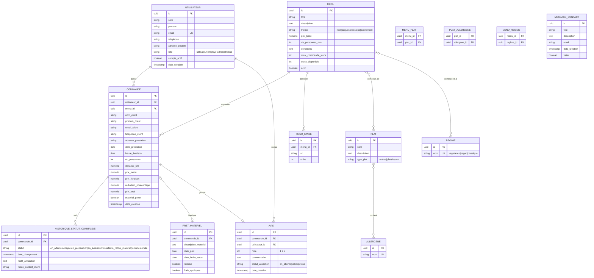

# Modèle Conceptuel de Données — Vite Gourmand

## 1. Diagramme entité-association (Mermaid)



## 2. Règles de gestion issues

- RG1 : le rôle `administrateur` ne peut pas être attribué via un formulaire applicatif (création uniquement en base ou via un compte admin existant).
- RG2 : `reduction_pourcentage` = 10 si `nb_personnes >= nb_personnes_min + 5`, sinon 0.
- RG3 : `prix_livraison` = 5 + (0.59 * distance_km) si la ville de prestation != Bordeaux, sinon 5.
- RG4 : une commande ne peut pas être annulée/modifiée par l'utilisateur une fois passée au statut `accepte`.
- RG5 : chaque changement de statut de commande crée une nouvelle ligne dans `HISTORIQUE_STATUT_COMMANDE` (jamais d'update destructif sur l'historique).
- RG6 : un avis n'est visible sur la page d'accueil que si `statut_validation = valide`.
- RG7 : `frais_appliques` passe à `true` si `restitue = false` après 10 jours ouvrés suivant le statut `attente_retour_materiel`.

## 3. Notes de conception NoSQL (MongoDB)

Collection `stats_menus` (document agrégé, recalculé ou mis à jour à chaque commande) :

```json
{
  "menu_id": "uuid-postgres",
  "titre_menu": "Menu de Noël",
  "nb_commandes": 42,
  "chiffre_affaires_total": 6300.50,
  "historique_mensuel": [
    { "mois": "2026-09", "nb_commandes": 5, "ca": 750.00 }
  ]
}
```

Cette collection est alimentée par une synchronisation applicative (Server Action) déclenchée à chaque changement de statut de commande vers `termine`, évitant de recalculer les agrégats à la volée sur PostgreSQL.
